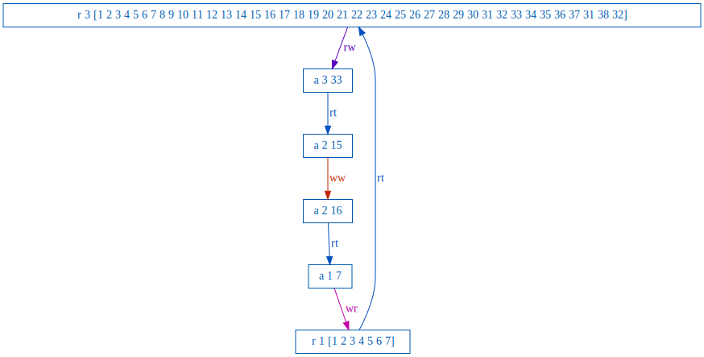
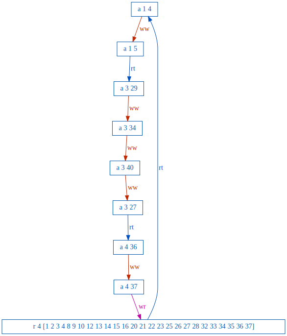
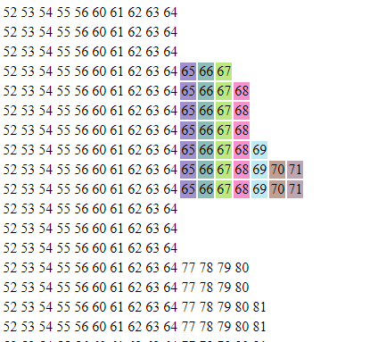

# Testing consistency for Redis and KeyDB Cluster modes with the Jepsen Framework.

## Redis and KeyDB
Redis is a widely used in-memory key-value database. It is popular due to its fast performance, ease of use and versatility. Large companies like Github, StackOverflow and Twitter use it successfully in production.

Fundamentally, Redis is built as a single-threaded application. The recent release version 7 introduced, for the first time, multi-threading for IO-writes. However, the core data handling is still single threaded.

In 2019 KeyDB changed the status-quo by creating a multi-threaded fork of Redis. Access to the datastore is exclusive for one thread, but all overhead is multithreaded. This new database has seen increasing popularity and has recently been acquired by Snap, the parent company of Snapchat. KeyDB is fully compatible with Redis, only providing feature extensions.

Redis, and by extension KeyDB, can handle a huge workload. But like any system, they have their limits. As is the case with many web-facing services, eventually you will reach a point where you will ask the question: “How can I scale up?”.

Both databases offer numerous horizontal scalability configurations. Users can choose between Replication mode, Sentinel mode or Cluster mode for the free open source version. Redis Labs offers a managed scalable DBaaS, and has an experimental Raft implementation in the works since 2019. All these modes can be individually tweaked to allow for specific consistency or availability constraints.

Changing from a single node to a distributed system can introduce some unwanted properties. A single Redis(like) node can be seen as a strongly consistent system, with the right configuration. But strong consistency in a distributed system is hard. As the Redis Cluster specification claims: “Redis Cluster was designed in order to cover the exact use cases of the non-clustered Redis version.”. Which is why today we will put it to the test.

In the past, Redis has been tested thoroughly using the Jepsen framework. In 2013 the (then) implementation of Redis Sentinel was put to the test. Sentinel has a lot of overlap with Redis Cluster, so we will expect to see similar behavior. However, a lot can change in 10 (!) years. Furthermore, in 2019 the Redis Raft experimental branch was tested with Jepsen. We will be retrofitting this test suite to work on a stable branch of Redis 7.0 cluster and KeyDB 6.2.

## Testing using the Jepsen framework
A Jepsen test has a clear structure. First the database is started, configured and set up as normal. Then, Jepsen lets you make client requests to the database nodes; what these requests are will be determined by a predefined function or list. While these requests are happening network faults or other anomalies are introduced into the system. Lastly, all responses to the requests are collected, stored and analyzed.

To do this analysis we picked Elle, a consistency checker which is part of the [Jepsen framework](https://github.com/jepsen-io/jepsen). This tool had two main benefits that made us choose it over other tools like porcupine or knossos. Firstly it gives the consistency property that has been violated and the consistency models the system thus can not be. This was useful for Redis and KeyDB since they only claim eventual consistency of their cluster modes. But Elle was able to rule out a lot of consistency models without having to specifically run tests for them all. Secondly Elle can handle larger test histories (list of request and response). This does come at a cost however, Elle is not guaranteed to find a fault in a history even if one exists, however Elle’s authors claim in their [paper](https://github.com/jepsen-io/elle/raw/master/paper/elle.pdf) that it: “comes close to guaranteeing completeness”.

### How Elle works
Elle’s speed comes from the fact that it is not checking all possible orderings of request executions which would be O(n!), but instead building a dependency graph between the requests and results. Then checking for cycles on that. The results do need to give enough information to actually build this graph. To get the most information about the history Elle recommends using lists that you can only append unique numbers to. After a read request for such a list you can infer all previous appends, the order in which they happened, and which have not happened yet.
For example when [1, 2] is read it implies an append of 2 happened before that (write-read dependency) and before that an append of 1 occurred (write-write dependency). If there was also an append of 3 that needs to have happened after (read-write dependency). Next to these dependencies Elle also adds edges for events that happened after each other (real-time dependency). To find consistency violations elle checks for cycles in the dependency graph. What type of edges appear in the cycle and how many of a given type determines which consistency models it violated.
For Strict Serializable no cycles at all are allowed. Since cycles are absent the dependency graph can be topologically sorted resulting in a possible serial execution.

### Introduced faults
In an ideal world all processes would always be able to communicate and would never crash. Unfortunately that is not the case, so we also can’t assume ideal circumstances when testing. The faults we injected during our tests were: partitioning the network, forcing failovers, pausing processes, and killing processes. For all of these except failovers we made use of Jepsen's provided implementation of them.
When partitioning the network communication between a primary and its replicas becomes difficult if not impossible, this prevents replicas from being entirely up-to-date.
When combining partitioning with forced failovers an outdated replica might try to become primary and accept some writes that later get lost when the original primary returns or lose writes of the original primary if it gets demoted.
Pausing a process is another way to make replicas go out of date or make the replicas think the primary failed. Like with partition and failover the recovery might cause problems.
Killing a process could cause data loss since Redis and KeyDB don't immediately write to disk.

### Test setup
All our tests were run using 9 nodes, 3 of which were primary nodes and 6 replicas, 2 for each primary. For the client, we used the Java Jedis client. We only allowed Jedis to try a request once. Each test we varied which nemeses were active. After each test we let Elle check the consistency up to strict-serializability. If it did not detect problems we say the test passed, otherwise we say it failed. In that case we note the most common cycle type Elle found and the lowest consistency level that is violated.

## Results
In Table 1 and 2 the test results can be found, they are split based on what hardware they were run on. The first line indicates how often tests failed for a number of runs. Below that some additional information is listed that was generated by the checkers.
For test cases where most failed an estimate of the number of stale reads or lost writes is also listed, this is calculated by keeping track of a list of acknowledged appends and checking if this list contained any values that were not read at the time the read started, each value is only counted once. Assuming the history jepsen generates is in the correct order.

| Faults | Redis | KeyDB |
|---|---|---|
| No Nemesis | **0/20 Failed** | **0/20 Failed** |
| Partition  | **9/20 Failed**   Violated: read-atomic, read-committed   Cause: G-nonadjacent-realtime, incompatible-order | **11/20 Failed**   Violated: read-atomic, read-committed   Cause: G-nonadjacent-realtime, incompatible-order |
| Partition + failover | **19/20 Failed**   Lost or stale: 152 / ~4000   Cause: G-nonadjacent-realtime, incompatible-order | **20/20 Failed**   Lost or stale: 256 / ~4000   Cause: G-nonadjacent-realtime, incompatible-order |
| Partition + failover + jedis retry = 5 | **19/20 Failed**   Lost or Stale: 172 / ~4000   Duplicated writes: 3   Cause: G-nonadjacent-realtime, incompatible-order | **19/20 Failed**   Lost or Stale: 233  /  ~4000   Duplicated writes: 6   Cause: G-nonadjacent-realtime, incompatible-order   |

Table 1. Test results run on a i7-3630QM, 8GB RAM, Docker WSL 2

| Faults | Redis | KeyDB |
|---|---|---|
| Kill | 1/13 Failed Cause: G0-realtime, g-nonadjacent-realtime | 0/13 Failed |
| Pause | 0/13 Failed | 1/13 Failed Cause: G-nonadjacent-realtime, incompatible-order |
| All | 0/13 Failed | 1/13 Failed Cause: G-nonadjacent-realtime |

Table 2. Test results run on a AMD Ryzen 7 3700X, 32GB RAM, Docker WSL 2

The consistency/isolation models that Elle most often gave as the lowest violated model were read-committed and read-atomic. Meaning that it has the lowest isolation level according to the ANSI/ISO SQL standard, namely read-uncommitted. And a lower consistency model than the lowest considered (read-atomic) by [A.Cerone et al.](https://drops.dagstuhl.de/opus/volltexte/2015/5375/pdf/15.pdf)
In the context of append only list this means that you could read a value that can disappear later on either because an outdated copy was read from a replica or because a write was lost even after it was read. We observed this in the histories we collected as writes that got lost even after they were read at least once.
The causes that are listed are (mostly) the names given to the cycles elle found, unfortunately our most common cause ‘g-nonadjacent-realtime’ has little literature on it; this is even noted in Elle’s source code.
A closely related cause: g-single-realtime can be seen in Figure 1 and is a cycle with one read-write edge and realtime edges. The rw edge that closes this cycle is most likely caused by a double append of 33 to list 3 that was observed at some later read not shown in the cycle.

|  |
| :--: |
| Figure 1. G-single-realtime violation Elle found. |

Another cause that sometimes occurred was G1c-realtime as seen in Figure 2. This cycle was likely caused by append 27 to 3 “a 3 27” being executed later than it reported.

|  |
| :--: |
| Figure 2. A G1c-realtime cycle |

The cycles we showed here were relatively small, but most of the cycles Elle found were a lot larger and difficult to draw conclusions from.

The ‘incompatible-order’ cause is one that is not detected via a cycle but checks for histories that diverge, say when one part of the cluster starts to go down a different path than the other half. An example of this can be seen in Figure 3 where the rows with highlighted values are reads of a list from a diverging history that is later lost when the value 77 is appended.

|  |
| :--: |
| Figure 3. Order of read lists, highlighted values are part of diverging history. |

Based on these violations Elle found it seems that Redis and KeyDB do not uphold strong consistency guarantees. We must note that there is a possibility that our interaction with or implementation of Jedis is introducing faults that are attributed to the system. The Jedis client is extensive in features and might have fault preventions built in that might introduce some inconsistencies.

Conclusions
In general, we still see some of the issues that Redis Sentinel had back in 2013, namely lost writes. This means that the system does not have the same consistency as a single node. This is to be expected, as this is what the Redis documentation [describes](https://redis.io/docs/management/scaling/). Overall, the system does seem less prone to split-brain scenarios and other issues as it was in 2013, which is a good improvement. This might be a bit hand-wavy, but Redis seems to have made good improvements in terms of sturdiness. To draw this conclusion more firmly we would also need to run this test suite on the Redis Sentinel version tested in 2013.

Furthermore, we have no reason to believe that Redis and KeyDB have a different level of consistency. Our results show some deviation in failure rates, but this difference can very well rely on chance alone due to the small sample size. Although this test is by far not exhaustive, it does seem that KeyDB can be a good drop-in replacement for Redis.

Reflection
What is interesting though is the discrepancies between what Redis supports in terms of consistency, and how it is used. A survey in 2016 shows that Redis is used for:
Cache (63%)
Session store (50%)
Job/Queue management (38%)
Distributed locking (15%)

We agree with the  assessment of [Kyle Kingsbury in 2013](https://aphyr.com/posts/283-call-me-maybe-redis) that Redis is a great cache database. But when using Redis as a queue management,  it must be allowed behavior that some writes will get lost under faulty conditions. This becomes even more important when used as a primary database.

Now, you might be wondering: “Is this really an issue?”. Well, the same survey shows that 67% of respondents store data in Redis which is not stored anywhere else. It even ends on the note that this number increased.

[In the words of Kyle](https://aphyr.com/posts/307-call-me-maybe-redis-redux): “As systems engineers, we continually struggle to erase the assumption of safety before that assumption causes data loss or downtime. We need to clearly document system behaviors so that users can make the right choices.”.

Our assessment is that if you plan to use Redis or KeyDB in a scalable environment, it should NOT be used for data that CANNOT be lost. Use it as a cache, use it sparsely as a job/queue system, but be aware that these systems are not intended as a Primary Database.

## Future work
Our test suite allows for a lot of different configurations, but due to time constraints it was not possible to do a thorough test for every combination of parameters.

Testing other faults and scenarios could allow us to catch even more anomalies. One scenario we have put some work into but were not able to finish was removing nodes from the cluster and later adding them back in. The difficulty we ran into was twofold. One: when removing a primary all its hash slots first need to be moved to another primary before it can be removed. Two: it was difficult to figure out which nodes were primaries and which replicas and take the respective actions. A network fault we would have liked to inject were packet drops and delayed, however these proved to be difficult, some of the methods we tried did not work because we could not load the required kernel models in docker on WSL.

